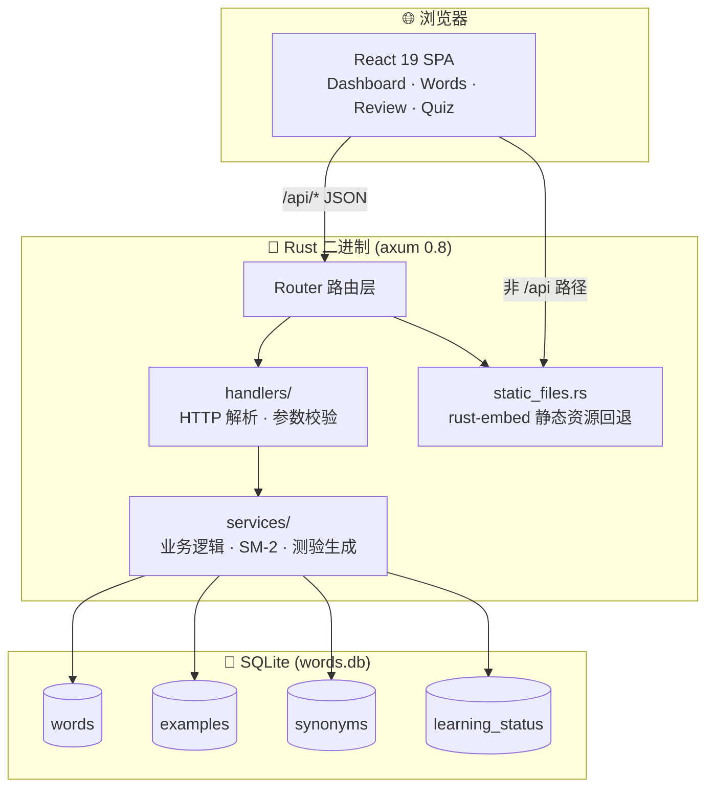

<div align="center">

# mywords

**一个为 GRE / TOEFL 备考打造的开源单词学习工具**

基于 SM-2 间隔重复算法 · 内置 10,000+ 词条 · 3D 沉浸式界面 · 单文件部署

[](./LICENSE)
[](https://www.rust-lang.org/)
[](https://react.dev/)
[](https://vite.dev/)
[](https://www.sqlite.org/)
[](https://github.com/zhongwei/zwords/pulls)

</div>

---

> [!NOTE]
> 后端 crate 名为 `mywords`，仓库目录名为 `zwords`，环境变量前缀统一为 `MYWORDS_`。

## ✨ 功能亮点

| 模块 | 说明 |
| :--- | :--- |
| 📚 **海量词库** | 内置 **10,100** 词条（GRE 6,492 + TOEFL 3,608），含音标、词性、中英释义、词根、联想、搭配、派生 |
| 🧠 **科学复习** | 采用成熟的 [SM-2 间隔重复算法](https://www.supermemo.com/en/archives1990-2015/english/ol/sm2)，根据记忆曲线智能调度复习时机 |
| 🎮 **多模式测验** | 支持英→中、中→英、同义词三类题型，答错自动加入复习队列 |
| 🌐 **中英双语** | 界面 i18n 一键切换简体中文 / English |
| 🎨 **3D 沉浸式 UI** | 基于 React Three Fiber 的 3D 翻转卡片、粒子特效与立体图表 |
| 📊 **可视化仪表盘** | 学习进度、掌握分布、复习节奏一目了然 |
| 📦 **单文件部署** | 前端经 `rust-embed` 编译期嵌入二进制，一条命令启动完整服务 |
| 💾 **零外部依赖** | SQLite 单文件存储，无需安装额外数据库服务 |

## 🚀 快速开始

### 方式一：从源码构建（推荐）

```bash
git clone https://github.com/zhongwei/zwords.git
cd zwords

# 1) 构建前端（需 Bun）
cd web && bun install && bun run build && cd ..

# 2) 启动后端（前端已内嵌）
cargo run
```

打开浏览器访问 <http://localhost:8000> 即可使用。

> [!TIP]
> 首次 `cargo run` 会自动编译依赖并嵌入 `web/dist/`，可能耗时数分钟。后续增量构建会快很多。

### 方式二：开发模式（前后端分离，支持 HMR）

需要两个终端：

```bash
# 终端 1：后端 API（默认 0.0.0.0:8000）
cargo run

# 终端 2：前端 Dev Server（默认 http://localhost:5173）
cd web && bun run dev
```

Vite 已配置将 `/api` 请求代理到 `http://localhost:8000`，开发时访问 <http://localhost:5173>。

### 前置要求

| 工具 | 版本 | 用途 |
| :--- | :--- | :--- |
| [Rust](https://www.rust-lang.org/tools/install) | stable（edition 2024） | 编译后端 |
| [Bun](https://bun.sh/) | ≥ 1.0 | 前端包管理与构建 |
| Python | ≥ 3.8（可选） | 仅在重建词库时需要 |

---

## 📑 目录

- [📸 项目预览](#-项目预览)
- [🏗️ 项目架构](#️-项目架构)
- [🧰 技术栈](#-技术栈)
- [📂 目录结构](#-目录结构)
- [🗄️ 数据库设计](#️-数据库设计)
- [🔌 API 参考](#-api-参考)
- [⚙️ 配置项](#️-配置项)
- [🧠 SM-2 复习算法](#-sm-2-复习算法)
- [🛠️ 开发指南](#️-开发指南)
- [📥 重建词库数据](#-重建词库数据)
- [🤝 贡献](#-贡献)
- [📄 License](#-license)

> [!TIP]
> 以下章节默认折叠，点击标题展开。GitHub 的目录跳转不会自动展开 `<details>`，需手动点击。

---

<details>
<summary><h2 id="-项目预览">📸 项目预览</h2></summary>

> 这里是 Dashboard / 词表 / 复习 / 测验 页面的截图位置。
>
> 截图功能待补充 —— 欢迎在 PR 中替换本节内容。

<!-- 示例格式：


-->

</details>

<details>
<summary><h2 id="️-项目架构">🏗️ 项目架构</h2></summary>

mywords 采用经典的「单体二进制 + SPA」架构：一个 Rust 二进制同时提供 REST API 和前端静态资源。



**分层职责：**

- **`handlers/`** — HTTP 解析层。只负责提取请求参数、调用 service、组装响应，不写业务逻辑。
- **`services/`** — 业务逻辑层。手写 SQL 与算法实现（SM-2、测验题目生成）。
- **`static_files.rs`** — 通过 `rust-embed` 在编译期把 `web/dist/` 嵌入二进制，运行时作为路由 fallback 提供 SPA 入口。

**连接模型：** SQLite 单连接包在 `Arc<Mutex<Connection>>` 中，开启 `WAL` 模式与外键约束，通过 axum `State` 在 handler 间共享。

</details>

<details>
<summary><h2 id="-技术栈">🧰 技术栈</h2></summary>

### 后端（Rust，edition 2024）

| Crate | 版本 | 用途 |
| :--- | :--- | :--- |
| [axum](https://crates.io/crates/axum) | 0.8 | Web 框架 |
| [tokio](https://crates.io/crates/tokio) | 1 | 异步运行时 |
| [rusqlite](https://crates.io/crates/rusqlite) | 0.31 | SQLite 驱动（bundled） |
| [serde](https://crates.io/crates/serde) / serde_json | 1 | 序列化 |
| [time](https://crates.io/crates/time) | 0.3 | 时间处理（不使用 chrono） |
| [tracing](https://crates.io/crates/tracing) + tracing-subscriber | — | 结构化日志 |
| [tower-http](https://crates.io/crates/tower-http) | 0.6 | CORS、Trace 中间件 |
| [rust-embed](https://crates.io/crates/rust-embed) + mime_guess | 8 / 2 | 编译期嵌入静态资源 |
| [lazy_static](https://crates.io/crates/lazy_static) | 1.5 | 全局状态 |

### 前端（`web/`）

| 库 | 版本 | 用途 |
| :--- | :--- | :--- |
| [React](https://react.dev/) | 19 | UI 框架 |
| [TypeScript](https://www.typescriptlang.org/) | 6 | 类型安全 |
| [Vite](https://vite.dev/) | 8 | 构建/HMR |
| [Tailwind CSS](https://tailwindcss.com/) | v4 | 原子化样式（`@tailwindcss/vite`） |
| [react-router-dom](https://reactrouter.com/) | 7 | 客户端路由 |
| [@tanstack/react-query](https://tanstack.com/query/latest) | 5 | 服务端状态管理 |
| [@react-three/fiber](https://docs.pmnd.rs/react-three-fiber) + drei + postprocessing | 9 / 10 / 3 | 3D 渲染 |
| [framer-motion](https://www.framer.com/motion/) | 12 | 动画 |
| [@base-ui/react](https://base-ui.com/) | 1 | shadcn 风格组件基座 |

</details>

<details>
<summary><h2 id="-目录结构">📂 目录结构</h2></summary>

```text
zwords/
├── src/                       # Rust 后端
│   ├── main.rs                # 路由装配、启动入口
│   ├── config.rs              # 从环境变量读取 Config
│   ├── db.rs                  # SQLite 连接初始化（WAL、外键）
│   ├── models.rs              # 数据结构与请求/响应 DTO
│   ├── error.rs               # AppError enum，实现 IntoResponse
│   ├── static_files.rs        # rust-embed 嵌入 web/dist/
│   ├── handlers/              # HTTP 解析层
│   │   ├── words.rs           #   单词 CRUD
│   │   ├── review.rs          #   复习调度
│   │   └── quiz.rs            #   测验流程
│   └── services/              # 业务逻辑层
│       ├── words.rs           #   单词 SQL
│       ├── review.rs          #   SM-2 算法
│       └── quiz.rs            #   题目生成与判分
├── web/                       # React 前端（Vite + bun）
│   └── src/
│       ├── pages/             # Dashboard · WordsList · WordDetail · Review · Quiz
│       ├── components/
│       │   ├── layout/        # MainLayout、Sidebar
│       │   ├── dashboard/     # Bar3D、RingProgress3D、StatsCards
│       │   ├── shared/        # CanvasBackground、Card3D、ParticleExplosion
│       │   └── ui/            # shadcn 风格基础组件
│       ├── hooks/             # useWords 等 React Query 封装
│       ├── lib/               # api、types、i18n、utils
│       └── locales/           # en.ts、zh.ts
├── scripts/
│   └── import_yaml_to_sqlite.py   # 从 YAML 重建 words.db
├── GRE_Word_List.yaml         # GRE 词库（数据源）
├── TOEFL_Word_List.yaml       # TOEFL 词库（数据源）
├── words.db                   # SQLite 数据库（运行时产物）
├── AGENTS.md                  # 给 AI 助手的项目说明
└── Cargo.toml                 # crate 名 mywords
```

</details>

<details>
<summary><h2 id="️-数据库设计">🗄️ 数据库设计</h2></summary>

SQLite 单文件 `words.db`，4 张表。完整 schema 见 [`scripts/import_yaml_to_sqlite.py`](./scripts/import_yaml_to_sqlite.py)。

### `words` — 单词主表

| 字段 | 类型 | 说明 |
| :--- | :--- | :--- |
| `id` | INTEGER PK | 自增主键 |
| `word` | TEXT | 单词 |
| `source` | TEXT | 来源，CHECK ∈ `('toefl','gre')` |
| `stage` | INTEGER | 阶段 |
| `phonetic` | TEXT | 音标 |
| `pos` | TEXT | 词性 |
| `meaning_cn` | TEXT | 中文释义 |
| `meaning_en` | TEXT | 英文释义 |
| `root` | TEXT | 词根 |
| `association` | TEXT | 联想记忆 |
| `collocations` | TEXT | 搭配 |
| `derivatives` | TEXT | 派生词 |
| `references` | TEXT | 参考 |

`UNIQUE(word, source) ON CONFLICT IGNORE`。

### `examples` — 例句

| 字段 | 类型 |
| :--- | :--- |
| `id` | INTEGER PK |
| `word_id` | INTEGER FK → `words(id)` ON DELETE CASCADE |
| `sentence` | TEXT |
| `translation` | TEXT |

### `synonyms` — 同义词

| 字段 | 类型 |
| :--- | :--- |
| `id` | INTEGER PK |
| `word_id` | INTEGER FK → `words(id)` ON DELETE CASCADE |
| `synonym` | TEXT |

### `learning_status` — 学习状态

| 字段 | 类型 | 说明 |
| :--- | :--- | :--- |
| `id` | INTEGER PK | |
| `word_id` | INTEGER UNIQUE FK → `words(id)` | |
| `status` | TEXT | CHECK ∈ `('new','learning','review','mastered')`，默认 `new` |
| `review_count` | INTEGER | 复习次数，默认 0 |
| `correct_count` | INTEGER | 答对次数，默认 0 |
| `last_reviewed_at` | TEXT | 上次复习时间（ISO 8601） |
| `next_review_at` | TEXT | 下次到期时间（ISO 8601） |
| `ease_factor` | REAL | SM-2 难度系数，默认 2.5 |
| `interval_days` | INTEGER | 当前间隔天数，默认 0 |

**连接初始化（`src/db.rs`）：** `PRAGMA journal_mode=WAL; PRAGMA foreign_keys=ON;`，单连接 + `Arc<Mutex>` 共享。

</details>

<details>
<summary><h2 id="-api-参考">🔌 API 参考</h2></summary>

所有端点以 `/api/` 开头，统一返回 JSON。错误格式：`{ "error": { "code": "...", "message": "..." } }`。

### 单词

| 方法 | 路径 | 说明 |
| :--- | :--- | :--- |
| `GET` | `/api/words` | 分页列表，支持过滤 |
| `POST` | `/api/words` | 新建单词 |
| `GET` | `/api/words/{id}` | 获取单词详情（含例句、同义词、学习状态） |
| `PUT` | `/api/words/{id}` | 更新单词 |
| `DELETE` | `/api/words/{id}` | 删除单词 |

**`GET /api/words` 查询参数：**

| 参数 | 类型 | 说明 |
| :--- | :--- | :--- |
| `page` | u32 | 页码，默认 1 |
| `per_page` | u32 | 每页条数，默认 50，上限 100 |
| `source` | string | `toefl` / `gre` |
| `status` | string | `new` / `learning` / `review` / `mastered` |
| `stage` | i32 | 阶段筛选 |
| `q` | string | 单词模糊搜索 |

**示例响应（`GET /api/words`）：**

```json
{
  "data": [
    { "id": 1, "word": "abandon", "source": "gre", "stage": 1, "phonetic": "/əˈbændən/", "...": "..." }
  ],
  "meta": { "page": 1, "per_page": 50, "total": 10096 }
}
```

### 复习

| 方法 | 路径 | 说明 |
| :--- | :--- | :--- |
| `GET` | `/api/review/next?limit=20` | 取到期/未复习的单词（按到期时间升序） |
| `POST` | `/api/review/{word_id}/answer` | 提交本次复习评分 |

**提交评分请求体：**

```json
{ "quality": 4 }
```

`quality` 为 0–5 的 SM-2 评分（0=完全忘记，5=完美记住），服务端据此更新 `ease_factor`、`interval_days`、`next_review_at`。

### 测验

| 方法 | 路径 | 说明 |
| :--- | :--- | :--- |
| `POST` | `/api/quiz/generate` | 生成一套测验题 |
| `POST` | `/api/quiz/{id}/submit` | 提交答卷并获取得分 |

**生成测验请求体：**

```json
{ "count": 20, "source": "gre", "type": "en2cn" }
```

| 字段 | 默认 | 说明 |
| :--- | :--- | :--- |
| `count` | 20 | 题量，上限 50 |
| `source` | 全部 | `toefl` / `gre` |
| `type` | `en2cn` | `en2cn`（英→中）/ `cn2en`（中→英）/ `synonym`（同义词） |

> ⚠️ **注意：** 测验会话当前保存在内存的 `lazy_static` HashMap 中，进程重启会丢失。提交答卷前请确保同一进程。

</details>

<details>
<summary><h2 id="️-配置项">⚙️ 配置项</h2></summary>

通过环境变量配置，均带默认值：

| 环境变量 | 默认值 | 说明 |
| :--- | :--- | :--- |
| `MYWORDS_HOST` | `0.0.0.0` | 监听地址 |
| `MYWORDS_PORT` | `8000` | 监听端口 |
| `MYWORDS_DB_PATH` | `./words.db` | SQLite 数据库路径 |

**示例：**

```bash
# 自定义端口
MYWORDS_PORT=8080 cargo run

# 使用其他数据库文件
MYWORDS_DB_PATH=/data/my-words.db cargo run

# 仅本机访问
MYWORDS_HOST=127.0.0.1 cargo run
```

</details>

<details>
<summary><h2 id="-sm-2-复习算法">🧠 SM-2 复习算法</h2></summary>

复习模块（`src/services/review.rs`）实现了 [SuperMemo 2](https://www.supermemo.com/en/archives1990-2015/english/ol/sm2) 算法的核心逻辑。

### 评分与调度

每次复习由用户给出 0–5 的 `quality` 评分：

| quality | 含义 |
| :--- | :--- |
| 0–2 | 没记住（答错） |
| 3 | 勉强想起，过程吃力 |
| 4 | 想起，略有迟疑 |
| 5 | 完美记住 |

### 核心公式

```text
EF' = EF + (0.1 - (5 - q) * 0.08)       # q >= 3 时更新；EF 最小为 1.3
EF' = EF                                 # q <  3 时保持不变

I' = 1                                   # q < 3 或首次复习
I' = ceil(I * EF')                       # 其他情况
next_review_at = now + I' 天
```

### 状态流转

```text
new ──(首次复习)──> learning ──(累计复习)──> review ──(correct_count≥5 且 EF≥2.0)──> mastered
```

答错（quality < 3）会让 `interval_days` 重置为 1，单词回到高频复习队列；测验中答对/答错也会以 quality 5/1 自动调用复习接口更新状态。

</details>

<details>
<summary><h2 id="️-开发指南">🛠️ 开发指南</h2></summary>

### 常用命令

**后端：**

```bash
cargo build              # 编译
cargo run                # 运行（监听 0.0.0.0:8000）
cargo test               # 运行所有单元测试
cargo test --lib         # 仅库测试
cargo clippy             # lint（建议）
```

**前端（在 `web/` 目录）：**

```bash
bun install              # 安装依赖
bun run dev              # 启动 Vite Dev Server（http://localhost:5173）
bun run build            # 类型检查 + 生产构建到 web/dist/
bun run lint             # ESLint
bun run preview          # 预览构建产物
```

### 开发工作流

推荐同时开两个进程：Vite Dev Server 提供 HMR 前端，Rust server 提供 API。Vite 已配置把 `/api` 代理到 `http://localhost:8000`。

```bash
# 终端 1
cargo run

# 终端 2
cd web && bun run dev
# 浏览器打开 http://localhost:5173
```

### 代码约定

- 用 `time` crate 处理时间，**不用** chrono
- 不用 ORM，**手写 SQL**（参数化查询，禁止字符串拼接用户输入）
- handler 只做 HTTP 解析，业务逻辑放 service 层
- 错误统一用 `AppError` enum，实现 `IntoResponse`
- 路径别名 `@` → `web/src`
- 前端组件遵循 shadcn / `@base-ui/react` 风格

### 项目说明文件

详细约定（架构、命名、测试策略）见 [`AGENTS.md`](./AGENTS.md)，该文件也供 AI 助手参考。

</details>

<details>
<summary><h2 id="-重建词库数据">📥 重建词库数据</h2></summary>

词库的真正数据源是仓库根的 `GRE_Word_List.yaml` 与 `TOEFL_Word_List.yaml`。`words.db` 是它们的派生产物，由脚本生成。

> [!WARNING]
> 该脚本会**先删除**已有的 `words.db`，属于破坏性操作。

```bash
pip install pyyaml
python scripts/import_yaml_to_sqlite.py
```

脚本会：

1. 删除现有 `words.db`
2. 建表并建索引
3. 解析两个 YAML，按 `source` 字段导入
4. 为每个单词初始化一行 `learning_status`（`status='new'`，`ease_factor=2.5`）

YAML 中的字段缩写映射（见脚本 `parse_word`）：

| YAML key | 数据库字段 |
| :--- | :--- |
| `P` | `phonetic` |
| `S` | `pos` |
| `C` / `CC` | `meaning_cn` / `meaning_en` |
| `R` | `root` |
| `A` / `L` / `RR` | `association` |
| `CO` | `collocations` |
| `D` | `derivatives` |
| `REF` | `references` |
| `E` / `T` | `examples.sentence` / `examples.translation` |
| `M` | `synonyms`（逗号分隔） |

</details>

## 🤝 贡献

欢迎提 Issue 反馈 bug 或建议，也欢迎 PR。如果是较大改动，请先开 Issue 讨论方案。

## 📄 License

[MIT](./LICENSE) © 2026 Wei Zhong
